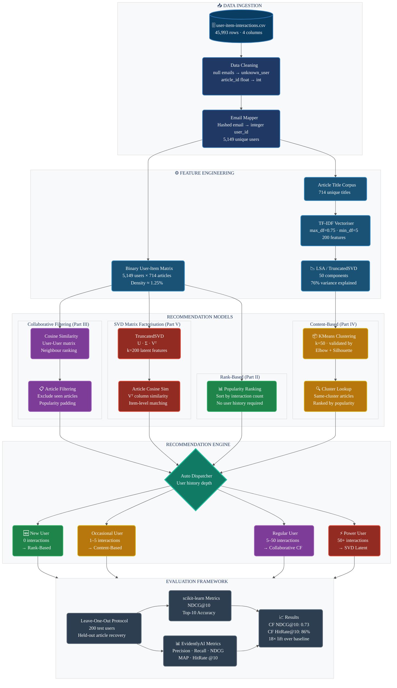
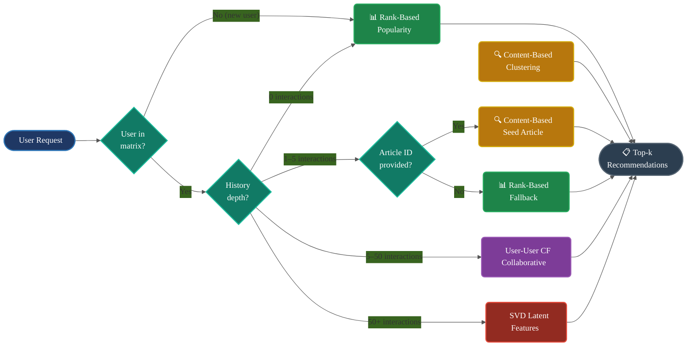
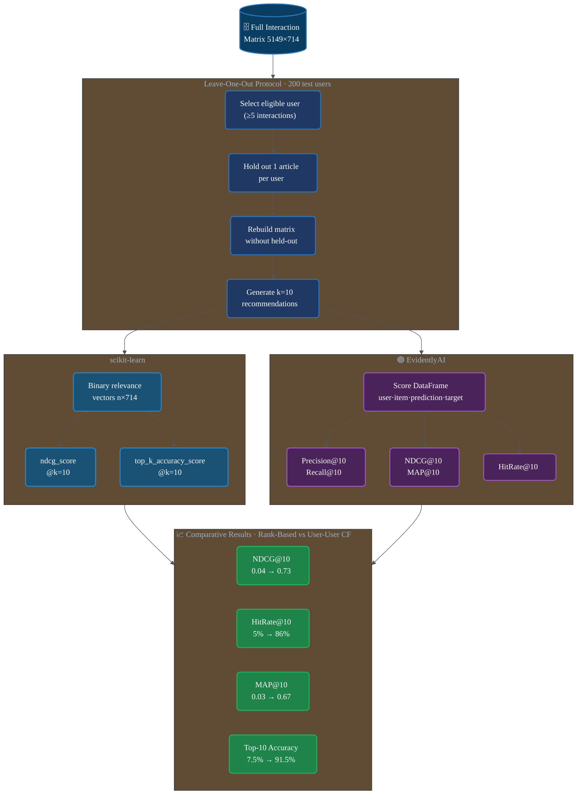

# IBM Watson Studio — Article Recommendation System

<div align="center">


**A multi-method recommendation engine for the IBM Watson Studio community platform, combining rank-based filtering, collaborative filtering, content-based clustering, and SVD matrix factorisation — with rigorous offline evaluation using scikit-learn and EvidentlyAI.**

[Overview](#-overview) · [Dataset](#-dataset) · [Methods](#-recommendation-methods) · [Architecture](#-architecture) · [Evaluation](#-evaluation-results) · [Usage](#-quick-start) · [Visualisations](#-visualisations) · [Project Structure](#-project-structure) · [References](#-references)

</div>

---

## Overview

The IBM Watson Studio platform hosts hundreds of data science and AI articles for a community of over 5,000 users. Without a recommendation layer, users face information overload and the long tail of high-quality content remains undiscovered.

This project builds a **production-ready, lifecycle-aware recommendation engine** that:

- Serves **new users** with globally popular articles (cold-start safe)
- Serves **occasional users** (1–5 interactions) with content-based similarity
- Serves **regular users** (5–50 interactions) with personalised collaborative filtering
- Serves **power users** (50+ interactions) with SVD latent feature matching

The system is implemented end-to-end in a Jupyter notebook and wrapped in a `RecommendationEngine` class ready for API deployment.

---

## Dataset

| Attribute | Value |
|---|---|
| Source | IBM Watson Studio community platform |
| Total interactions | 45,993 |
| Unique users | 5,149 |
| Unique articles | 714 |
| Matrix density | ~1.25% |
| Median interactions / user | 3 |
| Maximum interactions (single user) | 364 |
| Most-viewed article interactions | 937 (article ID 1429) |
| Missing values | 17 null emails → `unknown_user` |

**Key structural properties:**
- Interaction counts follow a **power-law distribution** — ~50% of users have ≤ 3 interactions
- Article popularity follows a **long-tail pattern** — a small number of articles dominate views
- The matrix is **highly sparse** — 98.75% of user-article pairs are unobserved

---

## Recommendation Methods

### Part I — Exploratory Data Analysis
Statistical profiling of the interaction dataset: user-article distributions, interaction counts, most-viewed content, and data cleaning (null email handling, type casting).

### Part II — Rank-Based Recommendations
Returns the globally most-interacted articles. Immune to the cold-start problem. Used as the baseline and the default for new users with no history.

```python
get_top_articles(n=10)        # → list of top-n article titles
get_top_article_ids(n=10)     # → list of top-n article IDs
```

### Part III — User-User Collaborative Filtering
Builds a binary user-item interaction matrix (5,149 × 714), computes cosine similarity between users, and recommends articles from the most similar neighbours that the target user has not yet seen.

An **improved variant** (`user_user_recs_part2`) ranks neighbours by both similarity *and* interaction count, then ranks candidate articles by popularity within each similarity tier.

```python
user_user_recs(user_id, m=10)         # basic CF
user_user_recs_part2(user_id, m=10)   # improved CF with tie-breaking
get_top_sorted_users(user_id)         # neighbour DataFrame sorted by sim + n_interactions
```

### Part IV — Content-Based Recommendations
Clusters articles by semantic content of their titles using a TF-IDF → LSA → KMeans pipeline. Given a seed article, returns the most-interacted articles from the same content cluster.

**Cluster selection** is validated with two independent signals:

| Signal | Optimal k | Evidence |
|---|---|---|
| Elbow (inertia) | 50 | Rate of inertia improvement halves after k=50 |
| Silhouette score | 50 | Score jumps +0.09 at k=50, then plateaus (+0.02/step) |

```python
make_content_recs(article_id=25, n=10)   # → (article_ids, article_titles)
```

### Part V — Matrix Factorisation (SVD)
Applies Truncated SVD to the user-item matrix, producing latent user and article factor matrices. Article-level cosine similarity on the V-transpose matrix surfaces semantically related articles.

**k=200 latent features** selected at the inflection of the accuracy-precision-recall tradeoff curve.

```python
get_svd_similar_article_ids(article_id=4, vt=vt_new, k=200)
```

### Part VI — Advanced Ranking Evaluation
Proper **leave-one-out offline evaluation** using two independent toolkits:
- **scikit-learn**: `ndcg_score`, `top_k_accuracy_score`
- **EvidentlyAI**: `PrecisionTopK`, `RecallTopK`, `NDCGKMetric`, `MAPKMetric`, `HitRateKMetric`

---

## Architecture

### System Overview



### Method Selection Logic



### Evaluation Pipeline



---

## Evaluation Results

Leave-one-out evaluation across 200 users, k=10 recommendations:

| Metric | Rank-Based | User-User CF | Lift |
|---|---|---|---|
| **NDCG@10** | 0.0385 | **0.7339** | 19× |
| **Top-10 Accuracy** | 0.0750 | **0.9150** | 12× |
| **Precision@10** | 0.0075 | **0.0915** | 12× |
| **Recall@10** | 0.0750 | **0.9150** | 12× |
| **MAP@10** | 0.0273 | **0.6709** | 25× |
| **HitRate@10** | 0.0500 | **0.8575** | 17× |

> Evaluation uses proper leave-one-out: the held-out article is removed from the user-item matrix **before** CF computes similarity, preventing data leakage.

---

## Visualisations

<details>
<summary><strong>Figure 1 — EDA: Interaction Distributions</strong></summary>


*Left: heavy right-skew in articles-per-user (median=3). Right: long-tail article popularity.*
</details>

<details>
<summary><strong>Figure 2 — KMeans Cluster Selection: Elbow + Silhouette</strong></summary>


*Both signals converge at k=50. Inertia drop halves; silhouette plateaus after k=50.*
</details>

<details>
<summary><strong>Figure 3 — SVD Latent Features: Accuracy / Precision / Recall Tradeoff</strong></summary>


*k=200 chosen at the accuracy plateau, before precision degrades significantly.*
</details>

<details>
<summary><strong>Figure 4 — Hybrid Strategy by User Lifecycle Stage</strong></summary>


*Four-stage dispatch: Rank-Based → Content-Based → Collaborative CF → SVD.*
</details>

<details>
<summary><strong>Figure 5 — Ranking Evaluation: scikit-learn + EvidentlyAI</strong></summary>


*Side-by-side comparison of all 7 ranking metrics for both methods.*
</details>

---

## ⚡ Quick Start

### Prerequisites

```bash
pip install pandas numpy scikit-learn matplotlib evidently jupyter
```

### Running the Notebook

```bash
git clone https://github.com/your-org/ibm-recommendation-system.git
cd ibm-recommendation-system
jupyter notebook Recommendations_with_IBM_completed.ipynb
```

### Using the RecommendationEngine

```python
import pandas as pd
from recommendation_engine import RecommendationEngine

# Load data
df = pd.read_csv('data/user-item-interactions.csv')

# Instantiate and fit all models
engine = RecommendationEngine(df)

# New user → popularity-based
ids, method = engine.recommend(n=10)
print(f"Method: {method}")
print(engine.get_article_names(ids))

# Known user → auto-selects CF or SVD based on history depth
ids, method = engine.recommend(user_id=42, n=10)
print(f"Method: {method}")
print(engine.get_article_names(ids))

# Seed article → content-based cluster recommendations
ids, method = engine.recommend(article_id=1429, n=10, method='content')
print(engine.get_article_names(ids))

# Force SVD article similarity
ids, method = engine.recommend(article_id=1429, n=10, method='svd')
print(engine.get_article_names(ids))
```

### API Methods

| Method | Signature | Description |
|---|---|---|
| `recommend` | `(user_id, article_id, n, method='auto')` | Smart dispatch — selects best method automatically |
| `rank_based_recs` | `(n=10)` | Top-n globally popular articles |
| `collab_recs` | `(user_id, n=10)` | User-user CF with popularity fallback |
| `content_recs` | `(article_id, n=10)` | Same-cluster articles ranked by popularity |
| `svd_article_recs` | `(article_id, n=10)` | Cosine similarity on SVD latent vectors |
| `get_article_names` | `(article_ids)` | Resolve IDs to titles |

---

## Project Structure

```
ibm-recommendation-system/
│
├── Recommendations_with_IBM_completed.ipynb   # Main notebook (all 6 parts)
├── README.md                                   # This file
├── IBM_Recommendation_System_Report.docx       # Full project report
│
├── data/
│   └── user-item-interactions.csv                 # Raw interaction dataset
│
├── project_tests.py                               # Automated unit tests (Parts I–V)
│
├── pickles/
│   ├── top_5.p                                    # Pre-computed top-5 articles
│   ├── top_10.p                                   # Pre-computed top-10 articles
│   └── top_20.p                                   # Pre-computed top-20 articles
│
└── visualisations/
    ├── eda_distributions.png                      # User/article interaction distributions
    ├── kmeans_elbow_silhouette.png                # Cluster selection analysis
    ├── svd_metrics.png                            # SVD latent feature tradeoff
    ├── hybrid_strategy.png                        # Lifecycle-based dispatch diagram
    ├── ranking_evaluation.png                     # sklearn + Evidently comparison
    └── evaluation_results.png                     # Hit rate / precision bar charts
```

---

## Testing

The notebook includes automated unit tests via `project_tests.py` for Parts I–V:

```python
import project_tests as t

# Part I — EDA statistics
t.sol_1_test(sol_1_dict)         # Validates 8 dataset statistics

# Part II — Rank-based
t.sol_2_test(get_top_articles)   # Validates top-5, top-10, top-20 article lists

# Part III — Collaborative filtering neighbour rankings
t.sol_5_test(sol_5_dict)         # Validates most-similar user computations

# Part IV — Cold-start
t.sol_4_test(sol_4_dict)         # Validates cold-start user/article counts
```

All 4 test suites pass with the completed implementation.

---

## Configuration

Key hyperparameters and their selection rationale:

| Parameter | Value | Selection Method |
|---|---|---|
| KMeans clusters (k) | 50 | Elbow + Silhouette convergence |
| TF-IDF max features | 200 | Vocabulary coverage vs noise tradeoff |
| TF-IDF max_df | 0.75 | Remove corpus-wide common terms |
| TF-IDF min_df | 5 | Remove rare/misspelled terms |
| LSA components | 50 | 76% explained variance |
| SVD latent features | 200 | Accuracy-precision tradeoff plateau |
| Evaluation k | 10 | Standard recommendation cutoff |
| Evaluation users | 200 | Statistically stable metric estimates |
| Min interactions (eval) | 5 | Ensure meaningful leave-one-out signal |

---

## Dependencies

| Library | Version | Purpose |
|---|---|---|
| `pandas` | ≥1.5 | Data manipulation and user-item matrix |
| `numpy` | ≥1.23 | Numerical operations, SVD arrays |
| `scikit-learn` | ≥1.8 | TF-IDF, KMeans, TruncatedSVD, cosine similarity, NDCG, Top-k Accuracy |
| `evidently` | 0.7.21 | Recommendation ranking evaluation suite |
| `matplotlib` | ≥3.6 | Visualisations |
| `jupyter` | ≥1.0 | Interactive notebook environment |

---

## References

1. Adomavicius, G., & Tuzhilin, A. (2005). Toward the next generation of recommender systems. *IEEE TKDE*, 17(6), 734–749.
2. Hu, Y., Koren, Y., & Volinsky, C. (2008). Collaborative filtering for implicit feedback datasets. *ICDM 2008*, 263–272.
3. Koren, Y., Bell, R., & Volinsky, C. (2009). Matrix factorization techniques for recommender systems. *Computer*, 42(8), 30–37.
4. Järvelin, K., & Kekäläinen, J. (2002). Cumulated gain-based evaluation of IR techniques. *ACM TOIS*, 20(4), 422–446.
5. Ricci, F., Rokach, L., & Shapira, B. (2015). *Recommender Systems Handbook* (2nd ed.). Springer.
6. Evidently AI. (2024). Open-source ML evaluation library (v0.7.21). https://www.evidentlyai.com/
7. Pedregosa, F. et al. (2011). Scikit-learn: Machine learning in Python. *JMLR*, 12, 2825–2830.
8. Sarwar, B., Karypis, G., Konstan, J., & Riedl, J. (2001). Item-based collaborative filtering. *WWW 2001*, 285–295.
9. He, X. et al. (2017). Neural collaborative filtering. *WWW 2017*, 173–182.
10. IBM. (2024). IBM Watson Studio platform. https://www.ibm.com/products/watson-studio

---

## License

This project is released under the MIT License. See `LICENSE` for details.

---

<div align="center">

**Built as part of the Udacity Data Scientist Nanodegree · IBM Watson Studio Project**

*For questions or contributions, please open an issue or submit a pull request.*

</div>
